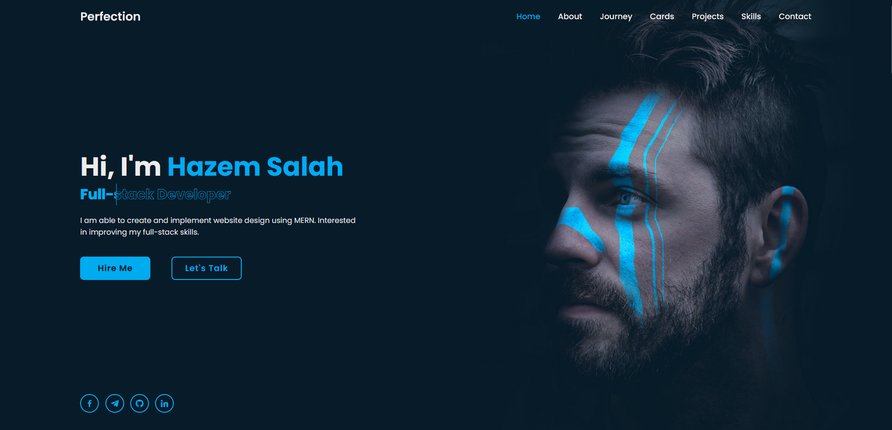

# Portfolio — Hazem Salah

> Personal portfolio site of a junior front-end / MERN developer in Chernihiv, Ukraine. Doubles as a working full-stack e-commerce demo (auth, cart, checkout, MongoDB) so recruiters can see real backend skill alongside the project gallery.

**[Live demo →](https://portfolio-aw0u.onrender.com)** &nbsp;·&nbsp; **[Email](mailto:hazem.salah1@msa.edu.eg)**

> First request may take ~30s while Render wakes the free-tier instance.



## About me

Self-taught front-end developer building production-quality React and MERN applications since 2023.
**Open to junior / intern / entry-level, remote or on-site worldwide.**

- **Front-end:** React 18, JavaScript (ES6+), TypeScript, HTML5, CSS3, Tailwind CSS, Context API, React Hooks
- **Back-end:** Node.js, Express, MongoDB, Mongoose, REST APIs, JWT auth
- **Tools:** Git / GitHub, VS Code, Postman, Figma
- **Languages:** Arabic (native), English (fluent)

## What this repo is

A full Express + MongoDB site rendered with EJS templates. Two things live in the same app:

1. **Portfolio gallery** — landing page, about page, and individual project showcase pages (`project2`–`project8`) covering my work in React, MERN, and 3D web.
2. **Working e-commerce demo** — a complete pharmacy storefront: product catalog, search, categories, cart, checkout, user accounts, sessions, image uploads. Built end-to-end so the backend chops are demonstrable, not just claimed on a CV.

## Stack

- **Server:** Node.js, Express 4, `express-ejs-layouts`, `express-session`, `connect-flash`, `cookie-parser`, `express-fileupload`
- **Views:** EJS (server-rendered, with layouts + partials)
- **Database:** MongoDB (Mongoose ODM)
- **Auth / sessions:** server-side sessions stored in MongoDB, cookie-based auth
- **Deploy:** Render

## Featured projects (linked from this site)

| Project                                         | Stack                    | Live                                            |
| ----------------------------------------------- | ------------------------ | ----------------------------------------------- |
| Aero — Apple-style drone scroll-canvas          | React, Vite, Canvas 2D   | [demo](https://aero-hnpd.onrender.com)          |
| Holocard — 3D link-in-bio dashboard             | React, Vite, Vanilla CSS | [demo](https://holocard-k8im.onrender.com)      |
| Prism — refractive glass octahedron studio      | React, R3F, drei         | [demo](https://prism-hmrd.onrender.com)         |
| Aether — shader-distorted blob studio           | React, R3F, Lenis        | [demo](https://aether-u93h.onrender.com)        |
| Auralis — drag-reveal audio store               | React, Vite              | [demo](https://auralis-3nb6.onrender.com)       |
| Future Vision — SVG-mask scroll-zoom            | React, Vite              | [demo](https://future-vision-3qd0.onrender.com) |
| Horizon — MERN travel booking                   | MERN                     | [demo](https://horizon-e620.onrender.com)       |
| Vega Store — MERN e-commerce                    | MERN                     | [demo](https://vega-store.onrender.com)         |
| Jardin Obscur — MERN luxury perfume store       | MERN                     | [demo](https://nellure.onrender.com)            |
| Cortex — MERN AI-platform marketing + dashboard | MERN, R3F                | [demo](https://cortex-qf7u.onrender.com)        |

## Run locally

```bash
npm install
npm start            # http://localhost:3333
```

Set up a `.env` file in the repo root with your MongoDB connection string:

```
MONGO_URI=mongodb+srv://<user>:<password>@<cluster>/<db>
SESSION_SECRET=<a long random string>
PORT=3333
```

## Contact

- **Email:** hazem.salah1@msa.edu.eg
- **Location:** Chernihiv, Ukraine — open to remote + on-site worldwide
- **Looking for:** junior / intern / entry-level / graduate / trainee front-end or MERN roles
